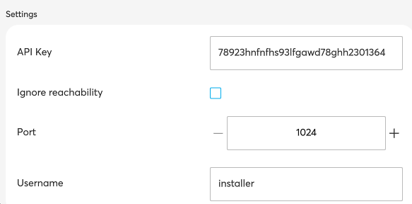

Addons provide the ability to add extensions to the existing free@home system.

## What is an addon

The addons are executed in an encapsulated environment on the Access Point 2.0 system.
This allows, among other things, third-party devices to be integrated into the free@home system.
The implementation of own logics for the control of actuators within free@home is also conceivable.

##  Structure of an addon

An addon consists of several files that are combined in a tar archive.

- free-at-home-metadata.json \  
  File with descriptions about the addon \
  A further description follows.
- Javascript files that implement the logic of the addon
- node_modules directory with all dependencies necessary to run the addon.

### Metadata of an addon

An addon is described via a JSON object.
The format of this object is described in the following interface:

- id \
  unique identifier for a script. This is build from a reversed domain name.
- name \
  a human readable name of the script\
  This name is shown in the UI of the Webinterface and in the App.
- description\
  a human readable description of the script
- entryPoint \
  relative path from the root of the archive to the main Javascript file. This file is executed by Nodejs.

```javascript
 export type Metadata = {
     version: string;
     id: string;
     name: string;
     description?: string;
     license: string;
     author?: string;
     url?: string;
     minSysapVersion?: string;
     entryPoint: string;
     "type": "app" | "runtime" | "standalone";
     parameters?: Parameters;
 };
```

## Using Parameters in Addons

Examples of the use of parameters:
- username and password
- API token
- IP-Address
- Port number




Supported types of parameters:
- string
- number
- boolean
## NodeJs Bibliothek

To simplify the development of addons, a NodeJS library is provided. This simplifies the creation and use of virtual devices. In addition, functions for the use of parameters are provided.

## Environment Limitations for Addons

Limitations of the environment in which an addon runs:

- ram 64MB max
- cpu 40% max
- tasks (threads) max: 20
