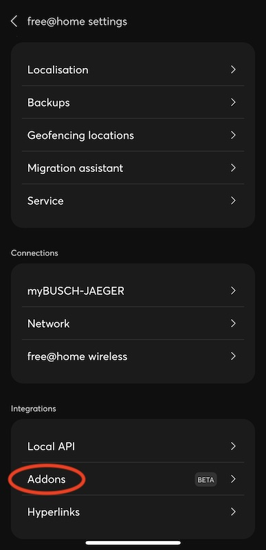
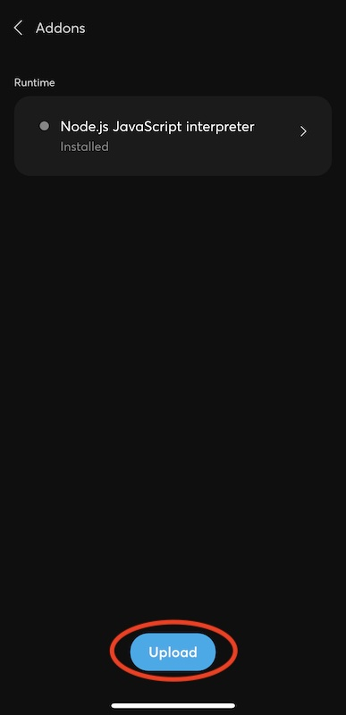

## Addon Deployment

------------------------------------------------------------------------

Development of addons can be done a local development machine, as described in this documentation.
However when development has finished, the addon files need to be packaged into a single archive
file and deployed to the system access point, so that it can run without the development machine.
This archive can then also be used by the end-user to install the addon directly to the System Access Point.

### Build an addon archive

Before uploading/deploying the addon to the System Access Point, it must be built into an addon archive file.
For this, the `free-at-home-cli` command line tool is provided:

```shell
./node_modules/.bin/tsc -p .
./node_modules/.bin/free-at-home-cli buildscriptarchive build
```

The `tsc -p .` (do not forget the '.' at the end) command will compile the TypeScript in the addon
and output it into the `build` directory by default (see `tsconfig.json` in the example directory).
The run command in vscode also performs this step.
The `free-at-home-cli` command will create an addon file from the contents of the `build` directory,
based on the `id` and `version` in the `free-at-home-metadata.json` metadata file, as described in
the metadata section. For example:

```shell
de.busch-jaeger.freeathome.example-1.0.0.tar
```

This file can be deployed to the System Access Point.

### Uploading the archive file to the System Access Point using the Command Line

When the addon archive file (`.tar` file) has been built successfully, it can be uploaded to the
System Access Point. This can also be done using the `free-at-home-cli` tool.

For this, first set environment variables for the System Access Point address and username/password credentials:

Windows:
```
$env:FREEATHOME_BASE_URL = 'http://[local ip of System Access Point]'
$env:FREEATHOME_API_USERNAME = '[username]'
$env:FREEATHOME_API_PASSWORD = '[password of user]'
```

Linux / Unix:
```bash
export FREEATHOME_BASE_URL='http://[local ip of System Access Point]'
export FREEATHOME_API_USERNAME='[username]'
export FREEATHOME_API_PASSWORD='[password of user]'
```

Then the archive file can be uploaded via the `free-at-home-cli` tool:

```shell
./node_modules/.bin/free-at-home-cli upload
```

This will automatically upload the file that was built before, i.e. with the filename from the `id`
and `version` values in the metadata.

Remember to stop the addon running on your local development machine when uploading a package,
otherwise the same addon will be running twice, causing errors, e.g. because of duplicated device
serials.

### Uploading the archive file to the System Access Point using the app or browser

Instead of uploading an addon archive using the `free-at-home-cli` command line tool, the archive
can also be uploaded using the app or a web browser. An end-user will always use this way, the
command line tool is used by developers only.

To do this, locate the `.tar` archive that was created by the
`free-at-home-cli buildscriptarchive build` command (e.g.
`de.busch-jaeger.freeathome.example-1.0.0.tar`).

When using the app: Transfer this file to your device, open the free@home next app and select
`Upload` under `More -> Installation Settings -> Addons`.





When using a web browser, open the System Access Point in the browser and navigate to the corresponding page.
