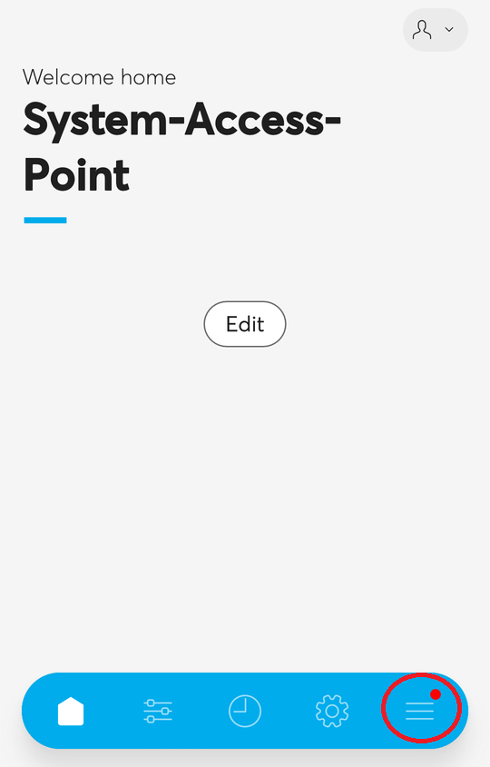
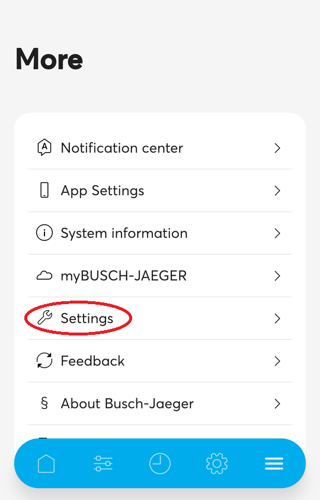
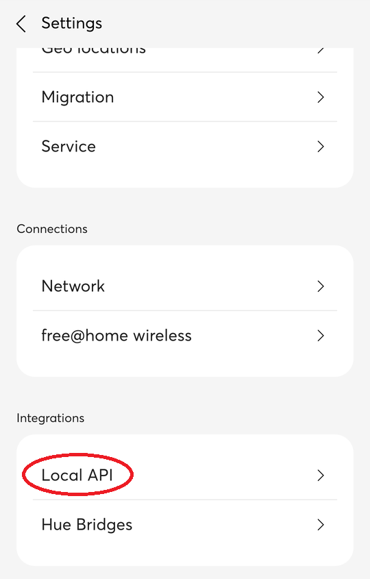
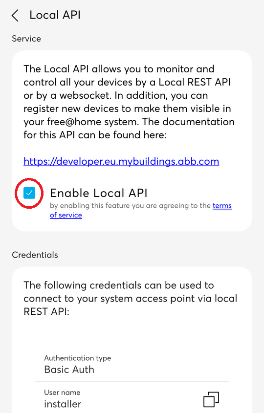

## Prerequisites for using the free@home add ons

------------------------------------------------------------------------

Add ons use the local API of the SysAP to access the current configuration and data model of the SysAP. For this, a few prerequisites have to be met by the end user.

### End user

The end user must enable the `activate local API` setting in the SysAP settings of the free@home next App,
found under `More -> free@home Settings -> Local API`.

The end user needs an ABB-free@home smart access point with version 3.0.0 or later.

To sum up, the end user/system access point requirements are:

- A system access point with at least version 3.0.0 must be available.

- The free@home next App for a mobile device.

- The system access point must enable the `activate local API` setting under
  `More -> free@home Settings -> Local API`.

