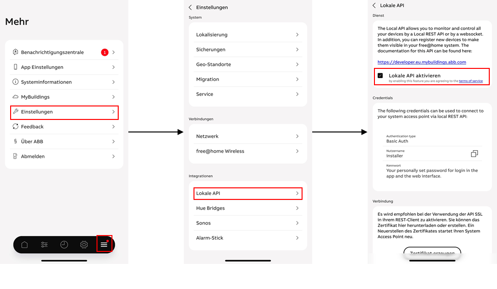
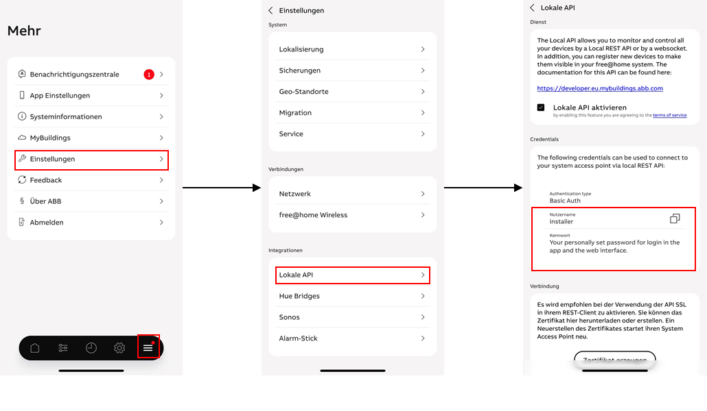
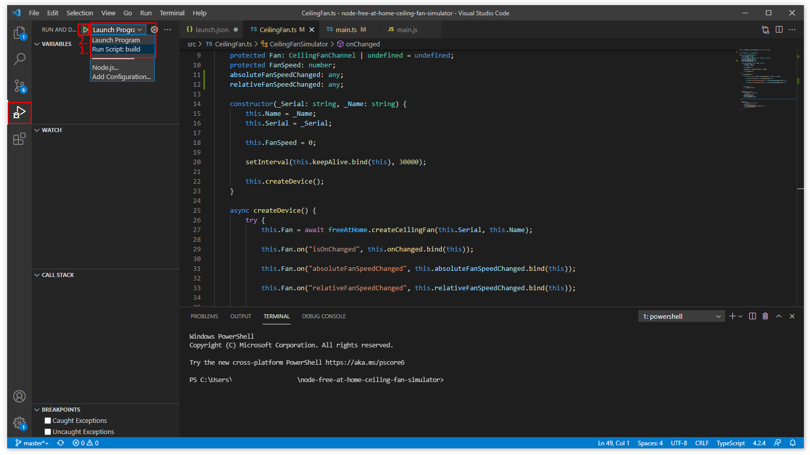
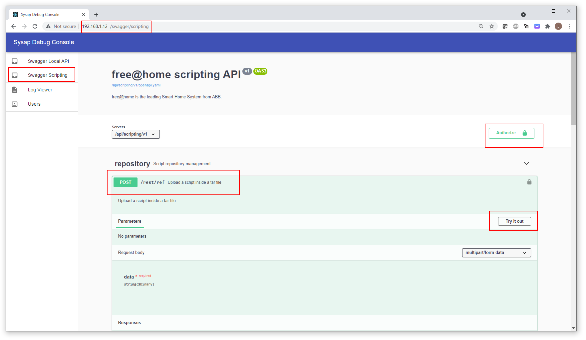
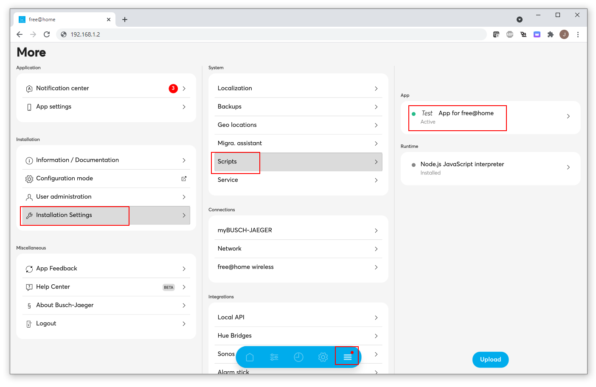

# How to getting started with the free@home scripting host

## Prerequisites

All scripting toward free@home scripting host is done in javascript / typescript.

1. Download and install node.js on your computer / machine -> [LINK](https://nodejs.org/en/download/)
2. Download and install GIT on your computer / machine -> [LINK](https://github.com/git-guides/install-git)
3. Download and install your favorite development suite

    1. [Atom](https://atom.io)
    2. [Visual Studio Code](https://code.visualstudio.com/download)
4. At least a free@home System Access Point must be installed and accessible locally
    1. The local API must be activated

    

## Let's start

First we will make the demo script (ceiling fan simulator) run on the development machine to try out the general behavior! This little demo script will make use of the capability of free@home API to create virtual devices inside the system which appear and behave as native free@home devices and can be controlled and observed from third parties. In this concret script example a simple ceiling fan device is created and if the user interacts with the ceiling fan device (e.g. turn on/ off) the script is return the value as feedback update. Thus the ceiling fan behaves as it was connected really to an external device.

1. Download the following [Demo Package](https://abb-my.sharepoint.com/:u:/p/jan_p_schaefer_de/EYekvaVmrKtPp-pQqeLkYg8B-6p2yyAHkmPtBuNOjYnHsQ?e=RFud9Q) and unzip to your disk
2. Open your development suite and select **open folder**, there pick the folder of Demo Package extracted beforehand.
3. In the file **launch.json** (in the subfolder **.vscode**) we have to modified the required data towards the System Access Point on premise:

            "FREEATHOME_API_BASE_URL": "http://192.168.x.x/fhapi/v1", (IP Address of the System Access Point)
            "FREEATHOME_API_USERNAME": "installer",                   (Username shown for local API in the free@home NEXT app)
            "FREEATHOME_API_PASSWORD": "12345"                        (Password shown for local API in the free@home NEXT app)

   

4. In the file **main.ts** (in the subfolder **src**) we can modify the folowing data

            const Fan = new CeilingFanSimulator("123abcawe987zzz", "test123"); (individual serial number of the device, Friendly Name of the device)

  

5. In the file **CeilingFan.ts** the logic described for the virtual Ceiling fan can be found and modified.

 

6. We go to the Debugger and choose **Run script: build** and press start
7. We choose **Launch Program** and press started

  

8. If everything is working properly the new virtual device should appear in the free@home webinterface / app and can be controlled

    

    

9. If the script is running sufficiently on the development machine we can start to build the package.
    1. open the terminal / console of your development suite
    2. Navigate to and open the **free-at-home-metadata.json** file
    3. Adjust the fields *name* and *version* to your needs
    4. type **npm run build** into the console and press enter
    5. type **npm run pack** into the console and press enter
    6. A file ending with *name.tar* schould appear inside the project folder
    

10. The tar file can be uploaded to the system access point like this:
    1. Open the webbrowser and type in <<ip adress of the System Access Point/swagger>>
    2. Click on *Swagger Scripting* at the left side
    3. Authorize with the credentials found in the free@home NEXT app in the *local API* menu 
    4. Choose the API endpoint */rest/ref/* and press *try out*
    5. Choose the .tar file by tapping the *Browse...* (next to *data\**) button and press *Execute*

If everthing worked proper a *200 OK* Message should be shown

Now the script can be activate inside the free@home webinterface or NEXT app by browsing to "More -> Installation settings -> Scripts"

## Concept

### Keynotes

* The scripts can be run remotely from the development machine addressing the System Access Point via local API
* The script can be build as a package which can be run in save environment on the System Access point
* The Scripting Engine comes with a free@home library which give the possibility to easily make use of the full potential of available virtual devices in free@home
  * The library can be found inside the project structure at "node_modules -> freeathome -> lib"
